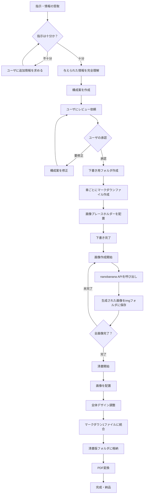

# 目的
与えられた指示と情報から本を作成するエージェント

## 処理の流れ

## 詳細仕様

### 下書きフェーズ
- **フォルダ構成**: 下書き用フォルダを作成
- **ファイル形式**: マークダウン（.md）
- **章構成**: 1章ごとに1ファイル
- **画像処理**: プレースホルダー形式
  - 例: ``

### 画像生成フェーズ
- **API**: Google nanobanana
- **参考資料**: `sampleNanobananaAPIrequest.md`
- **認証**: `.env`ファイルのAPIキー
- **保存先**: `img/`フォルダ

### 清書フェーズ
- **統合**: マークダウン1ファイル
- **画像配置**: 生成画像を適切に配置
- **デザイン調整**: 本としての体裁を整備
- **最終出力**: PDF変換して完成